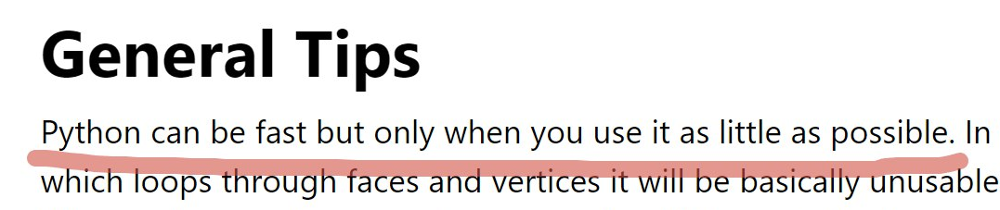

<!-- Начало: Анимация бегущей строки -->

<!-- Конец: Анимация бегущей строки -->

---

### 👨‍💻 About Me

-   🎓 I'm a student at **Ural Federal University (UrFU)**, studying at the [**FIIT**](https://fiit-urfu.ru/) program.
-   🤖 My primary area of interest is **Machine Learning (ML)**.
-   ❤️ My favorite languages are **Python** and **C#**.
-   📫 **Contacts:**
    

      
        
      
    

---

### 🛠️ Languages and Tools

 
   
  
  
  
  
   
   
   
   
   
   

---

### 🚀 My Projects

#### 🤖 ML
<table>
  <tr>
    <td width="50%">
      
    </td>
    <td width="50%">
      
    </td>
  </tr>
  <tr>
    <td width="50%">
      
    </td>
    <td width="50%">
      
    </td>
  </tr>
</table>

#### 🐍 Python
<table>
  <tr>
    <td width="50%">
      
    </td>
    <td width="50%">
      
    </td>
  </tr>
</table>

#### 🌐 Web Projects

  
    
  

#### 🎮 Game Development
<table>
  <tr>
    <td width="50%">
      
    </td>
    <td width="50%">
      
    </td>
  </tr>
</table>

---

### And finally...

  <!-- 
    Сюда нужно вставить прямую ссылку на ваш скриншот.
    Задайте нужную ширину в пикселях (например, width="600").
    Высота подстроится автоматически.
  -->
  

---

  

